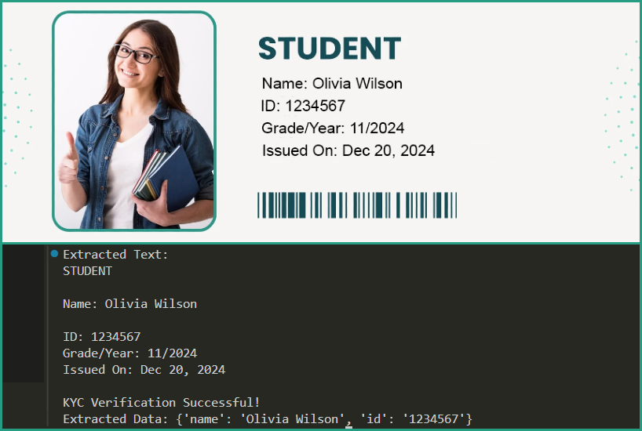

# Python-KYC

KYC (Know Your Customer) verification program in Python using OCR (Tesseract) to extract data from images of ID documents and simple regex patterns to verify extracted information.

## Preview

